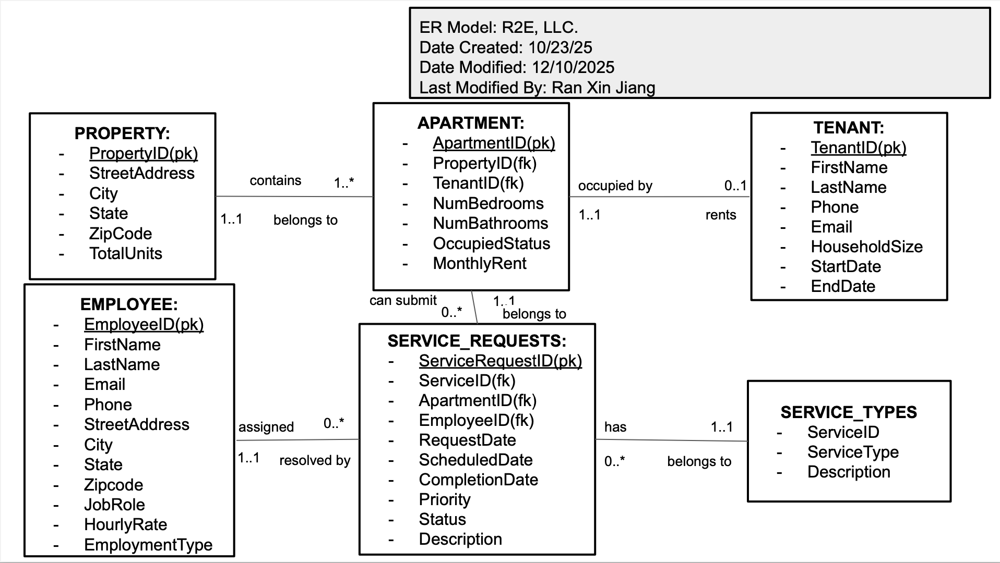

Developed as part of a graduate-level Systems Analysis & Design course, this project involved designing and implementing a relational tenant management database for a simulated property management company. The system replaces spreadsheet-based tracking with a structured Microsoft Access database that manages properties, tenants, service requests, and employees through centralized data entry, reporting, and query-based monitoring.

::: {.panel-tabset}

## Executive Overview



## Entity Relationship Diagram

{width=100%}

## System Features & Workflows



:::